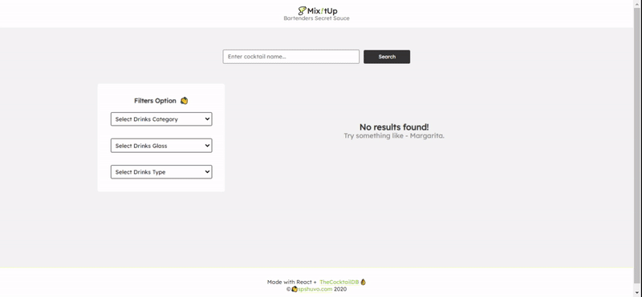

# 🍸 Mix!tUp

App for Bartenders Secret Sauce where they can find a quick instructions of making awesome cocktails. Built with Reactjs using [TheCocktailDB API](https://www.thecocktaildb.com/). This application was built for learning the fundamentals concepts of React. As a result of this, the application has a mixed several React APIs, including things like:

- Class Components
- Functional Components (Both Stateless and Stateful)
- React Hooks - `useState` and `useEffect`
- Context API
- Portals
- Error Boundaries and Many more.

## 🔴 Live Preview

The application is live @ [**this link**](https://mixitup.netlify.com) on Netlify.

## 🔒 Commands

Clone this repository the run command `npm install` from the root directory to install all the `npm` dependencies.

- **`npm run build`** - build production ready version
- **`npm run dev`** - running development server @ localhost:1234
- **`npm run format`** - Prettier will format your code
- **`npm run lint`** - running eslint

### 🎉 Can Be Improved

There are lots of things can be added to this application. Things like adding responsiveness. I didn't touch on responsiveness at all, and this was very intentional as this was primarily built for learning purpose. Besides this, you can also add things like:

- Storing favorite cocktail using LocalStorage
- Improving overall search experience
- May be a dark mode!
  _Feel free to PR. 🤘_
